[manishb.in](https://manishb.in) &nbsp;·&nbsp;
[linkedin](https://linkedin.com/in/manish-biswas) &nbsp;·&nbsp;
[twitter](https://twitter.com/itsmanishbiswas) &nbsp;·&nbsp;
[email](mailto:me@manishb.in)

> B.Tech ECE, NIT Agartala (class of '26). Applied AI Engineer. 
> LLMs, agents, and tools that hold up when you actually use them.

Currently building with GPT-4o, FastAPI, and WebSockets — figuring out how to 
make agents do useful things without going off the rails. Ex-intern @ Claro AI 
(Berlin): shipped real microservices to real users.

<samp>python &nbsp; typescript &nbsp; javascript &nbsp; go &nbsp; fastapi &nbsp; react &nbsp; next.js &nbsp; node &nbsp; openai &nbsp; langchain &nbsp; docker &nbsp; kubernetes &nbsp; postgres &nbsp; mongodb</samp>

**[AI-task-manager-agent](https://github.com/manish011003/AI-task-manager-agent-main)** &nbsp;·&nbsp; <samp>python, fastapi, openai</samp> 
AI task manager that talks to Notion. Giving GPT-4o write access to your 
todos turns out to be both helpful and terrifying.

**[ai-cicd-log-analyzer](https://github.com/manish011003/ai-cicd-log-analyzer)** &nbsp;·&nbsp; <samp>python, rag</samp> 
Intelligent CI/CD failure analysis — RAG over build logs so you get a 
diagnosis instead of a wall of red text.

**[geostocks-ai](https://github.com/manish011003/geostocks-ai)** &nbsp;·&nbsp; <samp>typescript</samp> 
Geo-aware stock tooling with an AI layer on top.

**[manishb.in](https://manishb.in)** &nbsp;·&nbsp; <samp>typescript, next.js</samp> 
Portfolio. Also: SIH 2023 — 2nd place out of 500+ teams.

Every graphic here is generated, not embedded from anyone else's server. 
`ascii.svg` is a photo pushed through a character ramp by 
[`scripts/make_portrait.py`](scripts/make_portrait.py); the stat graphics and 
these section headings are drawn by [a scheduled action](.github/workflows/stats.yml) 
straight from the GitHub GraphQL API, once a day, committing only what changed.

They animate with SMIL inside the SVG, because GitHub strips scripts from 
READMEs — and since nothing loads from a third party, nothing here can 
rate-limit or go dark. The headings are SVGs for the same reason: GitHub also 
strips CSS, so an image is the only way to put this page's own typeface on them.

The typeface is [JetBrains Mono](scripts/fonts), subset to just the characters 
each graphic draws and inlined as base64. That isn't only for looks: the 
portrait's grid assumes an advance width of exactly 0.600 em, and a viewer whose 
default monospace is narrower would otherwise see it squeezed.

Language totals cover public repositories only. `year.svg` uses the portrait's 
character ramp: `:` `+` `#` `@`, quiet to loud.
